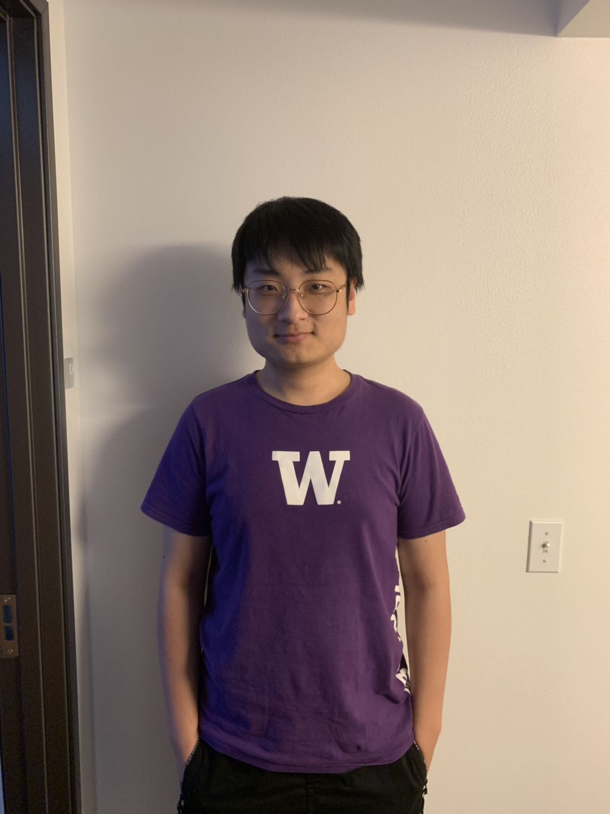

# SwapSpace

## About

A market place where users can post items that they are willing to trade for other items of value. Users can bid for items with any number of their own items. The seller will be able to filter the items being bid for theirs in order to choose which item to swap for.

## Team 

**Discussion 1A (12:00 PM)**

1. Don Le 

    **Github Username:** donle27

    

2. Rishab Sukumar

    **Github Username:** rsukumar75

    

3. Galen Wong

    **Github Username:** GalenWong

    

4. Gaohong Liu

    **Github Username:** Cheimu
    
    
    
## About

#Deploying on AWS (with and without scaling)

$ssh -i ~/.ssh/TEAMNAME.pem TEAMNAME@ec2-52-35-41-146.us-west-2.compute.amazonaws.com
$eb create -db.engine postgres -db.i db.t3.micro -db.user u -db.pass password --envvars SECRET_KEY_BASE=any-secret-you-like --single whatever-you-want-to-call-it

With vertical scaling
$eb create -db.engine postgres --instance_type m5.8xlarge -db.i db.t3.micro -db.user u -db.pass password --envvars SECRET_KEY_BASE=any-secret-you-like --single whatever-you-want-to-call-it

With horizontal scaling
$eb create -db.engine postgres --instances 3 -db.i db.t3.micro -db.user u -db.pass password --envvars SECRET_KEY_BASE=any-secret-you-like --single whatever-you-want-to-call-it

#TSUNG Testing
Start instance of CloudFormation and ssh into instance
$tsung -f test.xml start

Copy remote tsung logs into local computer
scp -r -i "TEAM_NAME.pem" ec2-user@ec2-52-40-132-169.us-west-2.compute.am azonaws.com:tsung_logs ./tsung_logs

